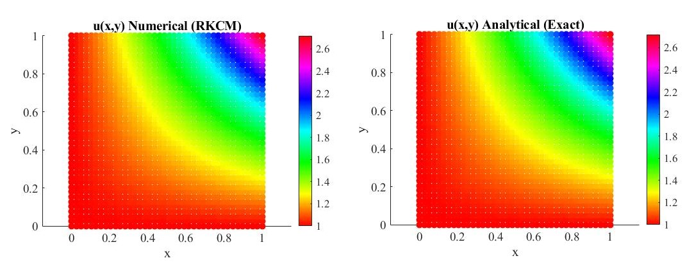

# Solving the 2D Poissons problem (coding in MATLAB)
## This work is copyrighted.

 

 This work applies the Reproducing Kernel Collocation (RKCM) method to solve the 2D Poissons problem. This is a meshfree numerical method using points as discretization in the domain. The Reproducing Kernel shape function is used as the approximation function in the model. For details regarding the complete formulation refer to <a href="https://doi.org/10.1002/num.20539" target="blank">this</a> paper. 
  
  
The overview of the problem statement and results obtained is given in <a href="latex/Poisson.pdf" target="blank">this pdf</a>.
 
 
The coding and plotting is done in MATLAB. The Python version of the same problem is in the repository <a href="https://bramyarao.github.io/2D-POISSON-PYTHON/" target="blank">2D-POISSON-PYTHON</a>.

 

